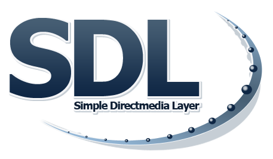

# SDLWin64
### Simple DirectMedia Layer for Delphi Win64

**SDLWin64** is Pascal bindings that allow you to use <a href="https://libsdl.org" target="_blank">SDL</a>  with <a href="https://www.embarcadero.com/es/products/delphi" target="_blank">Delphi</a>.

Included:
- SDL2 **(Latest)** :cool:

You simply add `SDL` to your uses section and everything will be linked in and ready for use.

***NOTE**: This distro is designed to work on Windows 10 or higher, 64 bits only.*

